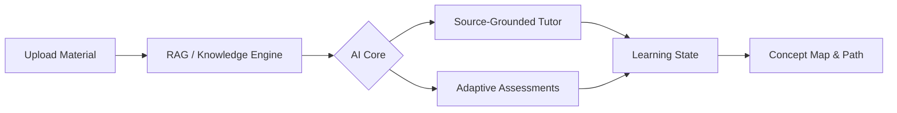

<div align="center">

# TutorForge AI

[](https://git.io/typing-svg)


**A personalized AI learning workspace that turns textbooks, lecture slides, notes, and supported learning media into source-grounded tutoring, adaptive assessments, concept mastery, and personalized learning paths.**

**Upload your material. Ask questions. Practice. See what you actually need to learn next.**

[](https://nextjs.org/)
[](https://react.dev/)
[](https://www.typescriptlang.org/)
[](https://tailwindcss.com/)
[](https://www.python.org/)
[](https://fastapi.tiangolo.com/)
[](https://ai.google.dev/)
[](https://www.sqlite.org/)
[](https://reactflow.dev/)
[](https://recharts.org/)
[](LICENSE)


</div>

---

### 🎓 What is TutorForge?

Studying usually means jumping between a textbook, lecture slides, recorded lectures, notes, and a lot of searching.

We wanted to build something that could actually connect all of that.

**TutorForge AI** turns your own learning material into a personalized study environment.

You can:

- upload your learning material
- ask questions about it
- get source-grounded answers
- see where the information came from
- practice with adaptive questions
- track concept-level mastery
- follow a personalized learning path

The core idea is:

**Material → Knowledge → Tutor → Assessment → Mastery → Recommendation**

---

### ✨ Features

<table>
<tr>
<td width="50%">

**📚 Multimodal Learning Library**

Bring together textbooks, lecture slides, notes, and supported audio/video material in one place.

**🤖 Source-Grounded AI Tutor**

Ask questions about your own material and get responses grounded in retrieved source content.

</td>
<td width="50%">

**📎 Real Source Citations**

Responses can point back to source pages, slides, or timestamps when available.

**🧠 Adaptive Assessments**

Question difficulty responds to the student's previous performance.

</td>
</tr>

<tr>
<td width="50%">

**📈 Concept-Level Mastery**

Track concepts as Mastered, Developing, Needs Review, or Not Started.

**🗺️ Personalized Learning Path**

Use current mastery to decide what the student should work on next.

</td>
<td width="50%">

**🕸️ Concept Map**

Explore relationships between course concepts while seeing current mastery.

**📊 Learning Analytics**

Track accuracy, mastery, questions answered, study activity, and learning signals.

</td>
</tr>
</table>

> **Not just an AI that answers questions — a study system that learns what you need to learn next.**

---

### 🛠️ Tech Stack

<div align="center">

| Layer | Technology |
|---|---|
| 🖥️ **Frontend** | Next.js + React + TypeScript |
| 🎨 **Styling** | Tailwind CSS |
| ✨ **Motion** | Framer Motion |
| 🐍 **Backend** | Python + FastAPI |
| 🗄️ **Database** | SQLite + SQLAlchemy |
| 🤖 **AI** | Google Gemini + Google GenAI SDK |
| 🔎 **Retrieval** | TutorForge retrieval / RAG layer |
| 🕸️ **Knowledge Graph** | React Flow |
| 📊 **Analytics** | Recharts |

</div>

---

### 🚀 Getting Started

```bash
# 1. Clone the repository
git clone https://github.com/ankush-dev-eng/TutorForge-AI.git
cd TutorForge-AI

# 2. Setup the Backend
cd backend
python -m venv .venv
source .venv/bin/activate  # On Windows use: .venv\Scripts\activate
pip install -r requirements.txt
cp .env.example .env       # Then add your GEMINI_API_KEY
python -m uvicorn main:app --reload --port 8000

# 3. Setup the Frontend (in a new terminal)
cd frontend
npm install
npm run dev
```

Then open `http://localhost:3000` to start exploring. ⚡

---

### 🖥️ How It Works (Under the Hood)



The system ingests multimodal content, chunks and vectorizes it, and builds a personalized knowledge graph. The AI Tutor and Assessment engines continuously interact with this graph, updating the student's mastery state in real time.

---

### 🗂️ Project Structure

```
TutorForge-AI/
├── backend/          # FastAPI, Python, GenAI SDK, SQLite
├── frontend/         # Next.js, React, Tailwind, Framer Motion
├── README.md
└── .gitignore
```

---

### 🤝 Contributing

Pull requests, issue reports, and feedback are all welcome!

1. 🍴 Fork the repo
2. 🌿 Create your feature branch (`git checkout -b feature/amazing-feature`)
3. 💾 Commit your changes
4. 📤 Push and open a PR

---

### 📄 License

Licensed under the **MIT License** — see `LICENSE` for details.

---

<div align="center">

### 💡 If you found this project helpful, drop a ⭐!


</div>
